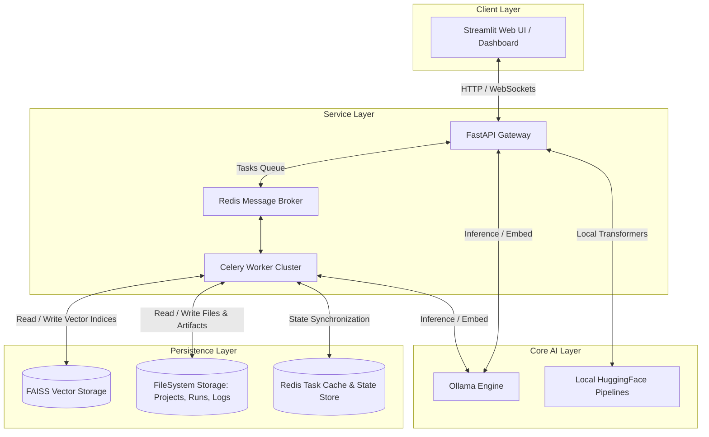
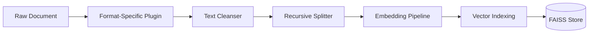
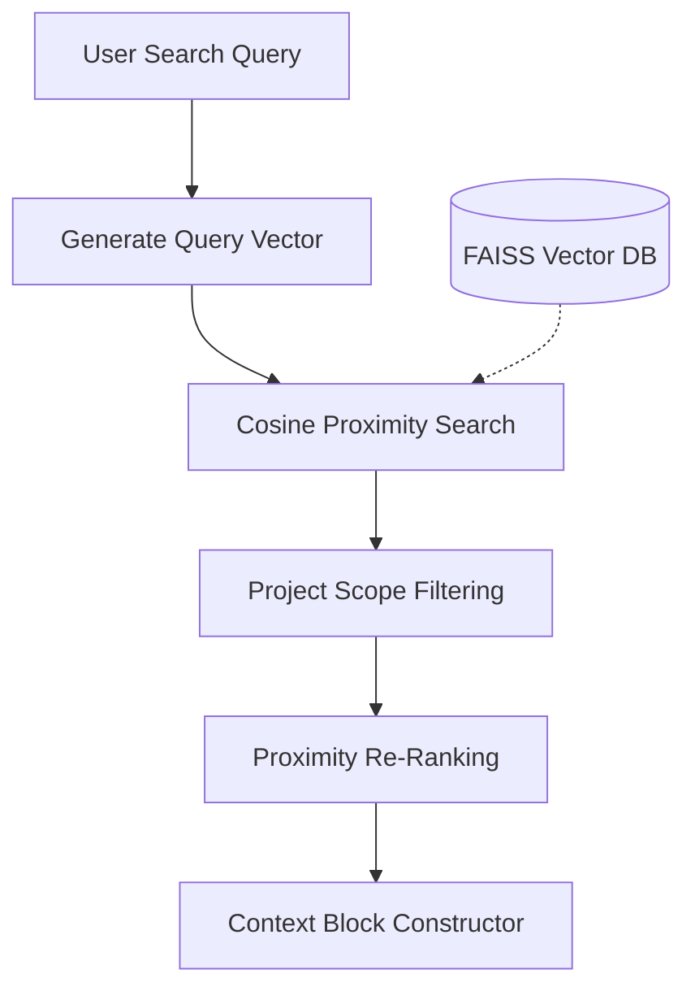
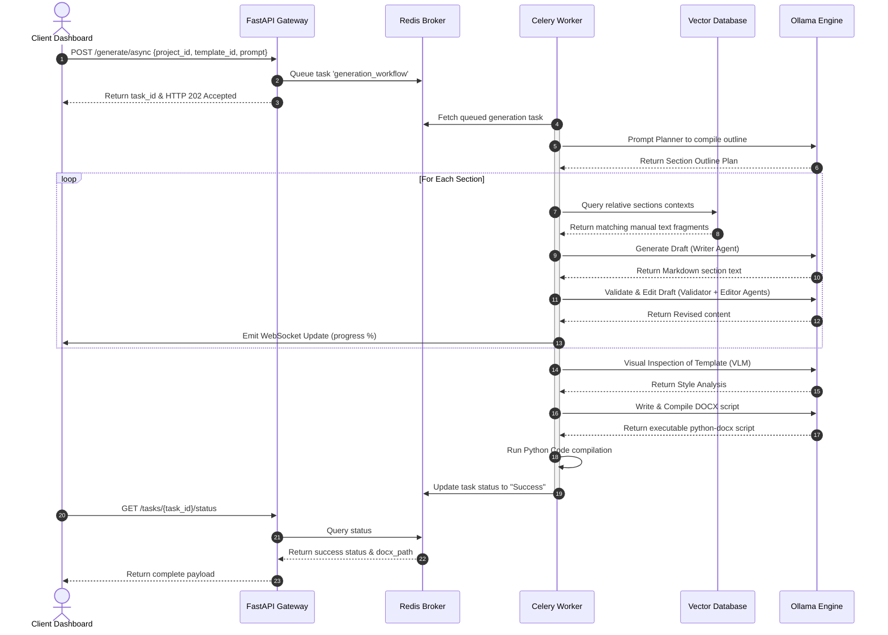
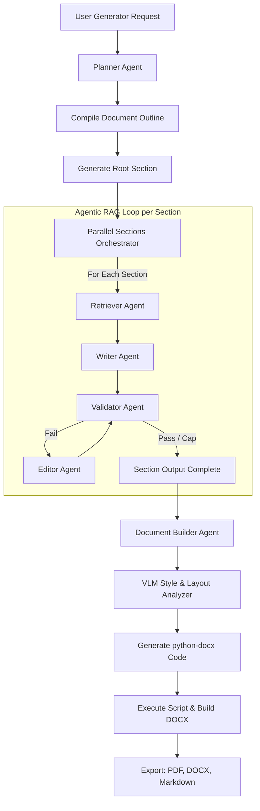

# Offline Retrieval-Augmented Generation (RAG) System: Comprehensive Manual

Welcome to the official technical documentation for the Offline Retrieval-Augmented Generation (RAG) System. This project is a local-first, privacy-preserving suite designed for enterprise and industrial environments. It enables high-fidelity natural language queries, technical troubleshooting, and structured document generation without requiring any external internet connectivity.

This system is split into two operational configurations:
* **Version 1 – Fault Diagnosis Assistant:** A local AI assistant that ingests engineering manuals, normalizes technical specifications, generates high-density local vector databases, and performs semantic retrieval to answer mechanical/electrical fault questions with precise citations.
* **Version 2 – Technical Documentation Generator:** An advanced multi-agent orchestrator that leverages a planning, retrieval, validation, and editing workflow to generate complete, styled DOCX, PDF, and Markdown documentation from partial notes and templates.

---

## Clickable Table of Contents

1. [System Architecture](#2-system-architecture)
   - [High-Level Architecture Overview](#high-level-architecture-overview)
   - [Core Component Interactions](#core-component-interactions)
   - [System Lifecycles & Data Flow](#system-lifecycles--data-flow)
2. [Complete Working of Version 1 (Fault Diagnosis Assistant)](#5-complete-working-of-version-1)
   - [Ingestion and Vector Search Lifecycle](#ingestion-and-vector-search-lifecycle)
   - [Query and Generation Pipeline](#query-and-generation-pipeline)
   - [Modular Ingestion Plugin Registry](#modular-ingestion-plugin-registry)
3. [Complete Working of Version 2 (Technical Documentation Generator)](#6-complete-working-of-version-2)
   - [The Multi-Agent Workflow](#the-multi-agent-workflow)
   - [Orchestrating Parallel Generation with Dependency Tracking](#orchestrating-parallel-generation-with-dependency-tracking)
   - [Vision-Language Model (VLM) Layout Analysis & Compilation](#vision-language-model-vlm-layout-analysis--compilation)
4. [Detailed Installation Guide](#8-installation-guide)
   - [Prerequisites & System Utilities](#prerequisites--system-utilities)
   - [Windows Setup Guide](#windows-setup-guide)
   - [Linux Setup Guide](#linux-setup-guide)
   - [macOS Setup Guide](#macos-setup-guide)
   - [Ollama and Local Models Downloader](#ollama-and-local-models-downloader)
5. [Running the Project](#9-running-the-project)
   - [Bootstrap & Directory Layout](#bootstrap--directory-layout)
   - [Batch and Script Launchers](#batch-and-script-launchers)
   - [Vector Database Maintenance Operations](#vector-database-maintenance-operations)
   - [Model Configuration and Selection](#model-configuration-and-selection)
   - [Hardware Acceleration: CPU vs GPU Configuration](#hardware-acceleration-cpu-vs-gpu-configuration)
6. [Troubleshooting Guide (50 Common Errors)](#18-troubleshooting-guide)
   - [Category A: Installation & Setup (Errors 1-10)](#category-a-installation--setup-errors-1-10)
   - [Category B: Environment & Pathing (Errors 11-18)](#category-b-environment--pathing-errors-11-18)
   - [Category C: CUDA, GPU & PyTorch (Errors 19-25)](#category-c-cuda-gpu--pytorch-errors-19-25)
   - [Category D: Ollama & Local LLMs (Errors 26-32)](#category-d-ollama--local-llms-errors-26-32)
   - [Category E: Vector DB, FAISS, Qdrant & Indexing (Errors 33-39)](#category-e-vector-db-faiss-qdrant--indexing-errors-33-39)
   - [Category F: Celery, Redis & Background Workers (Errors 40-44)](#category-f-celery-redis--background-workers-errors-40-44)
   - [Category G: Streamlit & Frontend UI (Errors 45-47)](#category-g-streamlit--frontend-ui-errors-45-47)
   - [Category H: Document Export & PDF Rendering (Errors 48-50)](#category-h-document-export--pdf-rendering-errors-48-50)
7. [Developer Extension Guide](#20-developer-guide)
   - [Registering New Models in the Configuration Registry](#registering-new-models-in-the-configuration-registry)
   - [Writing Document Parser Plugins](#writing-document-parser-plugins)
   - [Swapping the Vector Database Backend](#swapping-the-vector-database-backend)
   - [Creating New FastAPI Endpoints](#creating-new-fastapi-endpoints)
8. [Enterprise Deployment Guide](#21-deployment-guide)
   - [Intranet Server Deployment](#intranet-server-deployment)
   - [Air-Gapped Systems Deployment Strategy](#air-gapped-systems-deployment-strategy)
   - [Docker In-a-Box Setup](#docker-in-a-box-setup)

---

## 2. System Architecture

To understand this platform, we must first establish several core technical concepts:
* **Retrieval-Augmented Generation (RAG):** An AI architecture that enhances the capabilities of a Large Language Model (LLM) by retrieving relevant external facts from a local corpus before generating a response.
* **Embeddings:** High-dimensional numerical vectors (lists of floats, typically 384 or 768 dimensions) representing the semantic meaning of a word, sentence, or document fragment.
* **Vector Database:** A specialized database optimized for storing mathematical vectors and executing ultra-fast proximity queries (like Euclidean distance or Cosine similarity) to find semantically related text.
* **Vision-Language Model (VLM):** An LLM capable of analyzing image inputs alongside textual prompts to inspect document formatting, design elements, and style guidelines.
* **Celery Task Queue:** An asynchronous execution engine that runs long-running operations (like scanning large manuals or compiling documents) in background worker threads without freezing the main application.
* **WebSocket:** A persistent, two-way communication protocol enabling the backend to stream live generation progress to the user's dashboard in real-time.

### High-Level Architecture Overview

The platform uses a layered, CPU-optimized design. While it leverages CUDA-enabled GPU acceleration automatically if available, the core components are structured to prevent performance degradation on standard industrial workstations.



### Core Component Interactions

The coordination of components differs slightly between the two operational versions:

1. **Version 1 (Synchronous Fault Assistant):** The Streamlit client interacts directly with the backend server via simple API calls. Ingested files are passed to parser plugins, transformed into embeddings via PyTorch, indexed in FAISS, and queried instantly using local models.
2. **Version 2 (Asynchronous Agentic Workflow):** Since generating and styling complex technical reports takes time, the frontend issues non-blocking requests. FastAPI pushes these tasks to Redis, which acts as the broker for Celery workers. The workers carry out the multi-agent workflow, saving intermediate results and posting execution updates to Redis. Real-time updates are streamed back to the client using a WebSocket connection.

### System Lifecycles & Data Flow

#### Indexing Lifecycle


#### Retrieval Lifecycle


#### Document Generation Lifecycle


---

## 5. Complete Working of Version 1

Version 1 is a synchronous, context-constrained assistant designed to find answers from engineering documentation. It strictly prevents hallucination by referencing only the ingested vector fragments.

```
Document Upload ➔ OCR Extraction ➔ Cleansing ➔ Chunking ➔ Embedding Generation ➔ Vector Storage
                                                                                    │
User Query ➔ Query Embedding ➔ Similarity Search ➔ Prompt Construction ➔ LLM ➔ Grounded Answer + Citation ◄──┘
```

### Step 1: Document Upload
Files (such as a 500-page mechanical manual `engine_maintenance.pdf`) are uploaded through the Streamlit web dashboard. The request is processed by `ingestion_engine.py`, which validates the file size against the `MAX_UPLOAD_MB` safety limits and assigns a unique SHA-256 hash. If this hash matches an existing record in the filesystem database, the upload is skipped to save time and storage.

### Step 2: Optical Character Recognition (OCR)
If the document is a scanned image or a PDF lacking a native text layer, the system activates its OCR pipeline:
* **Primary Processor:** PaddleOCR. It runs a text detection model to find bounding boxes, followed by a text recognition model to read the content.
* **Secondary Fallback:** If PaddleOCR fails to load, the system falls back to Tesseract OCR via PyTesseract.
* *Example:* A scanned schematic diagram containing the text `"FLUID PRESSURE VALVE EXCEEDING 450 PSI"` is processed, returning both the extracted text and its page coordinates.

### Step 3: Cleaning
The raw text output from OCR or native extraction is often messy, containing headers, footers, page numbers, and formatting artifacts. The system cleans this text by:
1. Normalizing white spaces and converting carriage returns.
2. Stripping repeating running headers (such as `"Chapter 4: Engine Disassembly"`).
3. Filtering out unusable non-ASCII control characters.
* *Example:*
  * *Raw Text:* `\nEngine Manual   ---   Page 44\n\n1.  Loosen bolt  [A].\n`
  * *Cleaned Text:* `1. Loosen bolt [A].`

### Step 4: Chunking
Large documents cannot be fed into an LLM all at once due to context window limitations. The system splits the text using a **recursive, token-aware chunker** (`ingestion/chunker.py`):
* **Chunk Size:** 512 tokens.
* **Overlap:** 64 tokens (ensuring sentences spanning boundaries are not cut off).
* **Strategy:** It splits on double-newlines first, then single-newlines, and finally spaces, preventing sentences from being broken in half.
* *Example Output Chunk:*
  ```json
  {
    "chunk_id": "doc_8f12a3_chunk_4",
    "text": "Inspect the fuel injector nozzles for carbon buildup. If carbon buildup exceeds 0.5mm, soak the assemblies in solvent cleaning agent (Part No. 889-A) for exactly 45 minutes.",
    "source": "engine_maintenance.pdf",
    "page": 12
  }
  ```

### Step 5: Embedding Generation
Each text chunk is converted into a mathematical vector representation.
* **Model:** Local HuggingFace transformer pipelines (e.g., `BAAI/bge-small-en-v1.5`) running locally on CPU/GPU.
* **Process:** The text is tokenized, passed through the embedding model, and pooled to produce a float array of 384 dimensions.
* *Example Vector:* `[0.0125, -0.0841, 0.2039, ..., 0.0094]` (384 values).

### Step 6: Vector Storage
The generated vectors, along with their text chunks and metadata, are stored in a local **FAISS (Facebook AI Similarity Search)** vector database.
* **Index Type:** `IndexFlatL2` or `IndexFlatIP` (Inner Product).
* **Persistence:** Saved directly to disk as `vector_db/index.faiss` and metadata lookup maps `vector_db/index.pkl`. It supports incremental indexing, allowing you to add new documents without rebuilding the entire database.

### Step 7: User Query
The user enters a question in the chat interface:
`"How do I clean carbon from the fuel injector nozzle?"`

### Step 8: Embedding Query
The user's query is converted into a vector using the same embedding model as the document chunks, ensuring they share the same vector space.
* *Query Vector:* `[0.0118, -0.0820, 0.2011, ..., 0.0091]` (384 values).

### Step 9: Similarity Search
The system searches the FAISS index to find the vectors closest to the query vector.
* **Proximity Measure:** L2 Euclidean Distance.
* **Results:** The system retrieves the top $K$ closest chunks ($K=6$ by default) along with their similarity scores.
* **Filtering:** Results below a 0.60 similarity confidence threshold are excluded to avoid using irrelevant context.

### Step 10: Prompt Construction
The system formats the retrieved text chunks into a structured context block and injects it into a safety-oriented system prompt.

```
SYSTEM PROMPT:
You are an offline Fault Diagnosis Assistant. Answer the USER QUERY using only the context provided below. If the answer cannot be found in the context, state "I cannot answer this based on the available manuals." Do not use external knowledge.

CONTEXT:
---
[Source: engine_maintenance.pdf, Page 12]
Inspect the fuel injector nozzles for carbon buildup. If carbon buildup exceeds 0.5mm, soak the assemblies in solvent cleaning agent (Part No. 889-A) for exactly 45 minutes.
---

USER QUERY:
How do I clean carbon from the fuel injector nozzle?
```

### Step 11: Local LLM Inference
The constructed prompt is sent to the local inference engine (e.g., `Phi-3-mini-4k-instruct` running via Ollama or HuggingFace transformers). Since this runs completely offline, no data is sent outside the local system.

### Step 12: Answer Generation
The local LLM processes the prompt and generates a grounded response.
* *Response:* `"To clean carbon from the fuel injector nozzle, check if the buildup exceeds 0.5mm. If it does, soak the nozzle assemblies in solvent cleaning agent (Part No. 889-A) for exactly 45 minutes."`

### Step 13: Source Citation
The system parses the response, matches the retrieved chunk sources, and displays citations in the UI.

```
Response:
To clean carbon from the fuel injector nozzle, check if the buildup exceeds 0.5mm. If it does, soak the nozzle assemblies in solvent cleaning agent (Part No. 889-A) for exactly 45 minutes.

Sources Cited:
1. engine_maintenance.pdf - Page 12 (Confidence: 89.4%)
```

---

## Modular Ingestion Plugin Registry

The ingestion pipeline uses a modular plugin pattern. Every file format parser inherits from a common base class:

```python
# plugins/base_plugin.py
from abc import ABC, abstractmethod
from typing import List, Dict, Any
from dataclasses import dataclass

@dataclass
class DocumentChunk:
    text: str
    source: str
    page: int
    metadata: Dict[str, Any]

class BasePlugin(ABC):
    """Abstract Base Class for all document parsing plugins."""
    
    # List of file extensions supported by this plugin
    SUPPORTED_EXTENSIONS: List[str] = []

    @abstractmethod
    def extract(self, file_path: str) -> List[DocumentChunk]:
        """
        Extract text from file and return a list of DocumentChunks.
        
        Args:
            file_path: Absolute path to the local file.
        """
        pass
```

Custom plugins can be added by placing them in the `plugins/` directory. The plugin registry (`ingestion/plugin_registry.py`) dynamically discovers them at startup:

```python
# ingestion/plugin_registry.py
import importlib
import os
import sys
from pathlib import Path
from plugins.base_plugin import BasePlugin

class PluginRegistry:
    def __init__(self):
        self.plugins = {}
        self.load_plugins()

    def load_plugins(self):
        plugins_dir = Path(__file__).parent.parent / "plugins"
        for file in os.listdir(plugins_dir):
            if file.endswith("_plugin.py") and file != "base_plugin.py":
                module_name = f"plugins.{file[:-3]}"
                module = importlib.import_module(module_name)
                for item_name in dir(module):
                    item = getattr(module, item_name)
                    if isinstance(item, type) and issubclass(item, BasePlugin) and item != BasePlugin:
                        instance = item()
                        for ext in instance.SUPPORTED_EXTENSIONS:
                            self.plugins[ext.lower()] = instance
                            
    def get_plugin_for_file(self, filename: str) -> BasePlugin:
        _, ext = os.path.splitext(filename)
        plugin = self.plugins.get(ext.lower())
        if not plugin:
            raise ValueError(f"No parser plugin registered for extension: {ext}")
        return plugin
```

---

## 6. Complete Working of Version 2

Version 2 is an offline document generation system that coordinates multiple specialized agents to write, format, validate, and export structured technical documents.

### The Multi-Agent Workflow



1. **Planner Agent:** Ingests the main generation prompt and required sections to create an execution plan. It structures the document outline, defining section titles, objectives, and dependency chains.
2. **Retriever Agent:** Runs semantic searches against local project libraries to collect reference documents and templates matching the context requirements of each section.
3. **Writer Agent:** Writes the content for each section using the retrieved technical documentation and context from preceding sections.
4. **Validator Agent:** Checks draft sections against quality parameters:
   * It ensures the section has a minimum length of 50 characters.
   * It checks for clear logical flow and flags potential hallucinations.
   * It verifies that technical facts match the source citations.
   * It classifies issues as `ERROR`, `WARNING`, or `INFO`.
5. **Editor Agent:** If a section fails validation, the Editor Agent revises the text based on the validator's feedback. This loop runs for up to 3 iterations before saving the section.

### Orchestrating Parallel Generation with Dependency Tracking

To generate documents efficiently, sections are processed concurrently while respecting their logical dependencies.
* **Topological Sort:** The `SectionGenerationOrchestrator` uses a depth-first search (DFS) algorithm to detect circular dependencies and sort sections into a valid execution sequence.
* **Serial Root Section:** The first section (such as the Introduction or Executive Summary) is always generated first.
* **Parallel Execution with Semaphore:** The remaining sections are generated concurrently using an `asyncio.Semaphore` (configured via `MAX_CONCURRENT_SECTIONS`, defaulting to 3 concurrent tasks) to manage system memory load.
* **Context Cascading:** When a section completes, its first 500 characters are stored and passed to subsequent sections as context, ensuring cohesive transitions.

### Vision-Language Model (VLM) Layout Analysis & Compilation

To ensure professional styling, Version 2 uses a visual inspection pipeline to replicate layout templates:
1. **Visual Style Extraction:**
   * **DOCX Templates:** Margins, heading hierarchies, font faces, and color schemes are read using `python-docx`.
   * **PDF Templates:** The first page is rendered as an image using PyMuPDF and sent to a local VLM (like `llava` or `qwen2-vl` via Ollama) along with a styling extraction prompt.
   * **Image Templates:** The raw image is passed to the VLM to analyze layout details such as headers, footers, logo placement, and alignment.
2. **Dynamic Script Generation:**
   The styling data is converted into a textual description. The system prompts the writing LLM to generate a self-contained python-docx script that compiles the sections into a document matching the template's style.
3. **Self-Correction Runtime Loop:**
   * The backend runs the generated Python script in a separate process (`subprocess.run`).
   * If the script runs successfully, the compiled document is saved.
   * If the script raises an error (such as a python-docx syntax error), the traceback is captured and sent back to the LLM to write a corrected version. This self-correction loop runs for up to 3 attempts.
   * If all attempts fail, the system falls back to a clean, default styling engine to assemble the document.

---

## 8. Installation Guide

This section guides you through installing the application on a new system without pre-installed developer tools.

### Prerequisites & System Utilities

To run this platform, your computer must meet the following hardware requirements:
* **RAM:** Minimum 16 GB (32 GB recommended for running larger local models).
* **Disk Space:** At least 20 GB of free space to accommodate local embedding and language models.
* **GPU (Optional):** NVIDIA GPU with CUDA support for accelerated model inference.

### Windows Setup Guide

#### Step 1: Install Python and Git
1. Download the Python 3.10.11 installer from the [official Python downloads page](https://www.python.org/downloads/release/python-31011/).
2. Run the installer. **IMPORTANT:** Check the box that says **"Add Python 3.10 to PATH"** before clicking install.
3. Download Git from the [official Git downloads page](https://git-scm.com/download/win). Install it using the default settings.

#### Step 2: Set Up the Project Environment
Open a new PowerShell terminal as an administrator and run:

```powershell
cd RAG-Document-Generator

# Create a virtual environment
python -m venv venv
.\venv\Scripts\Activate.ps1

# Upgrade pip and install build tools
python -m pip install --upgrade pip setuptools wheel
```

#### Step 3: Install Project Dependencies
Install the required packages. If you don't have an NVIDIA GPU, install the CPU-only version of PyTorch:

```powershell
# For CPU-only systems:
pip install torch torchvision torchaudio --index-url https://download.pytorch.org/whl/cpu

# For NVIDIA GPU (CUDA 11.8) accelerated systems:
pip install torch torchvision torchaudio --index-url https://download.pytorch.org/whl/cu118

# Install standard dependencies
pip install -r v2/requirements.txt
```

---

### Linux Setup Guide

#### Step 1: Install System Dependencies
Open a terminal and install Python, development libraries, and Tesseract OCR:

```bash
sudo apt update && sudo apt upgrade -y
sudo apt install -y python3.10 python3.10-venv python3-pip git build-essential \
                    libgl1-mesa-glx tesseract-ocr ffmpeg redis-server
```

#### Step 2: Open the Project and Set Up the Environment
```bash
cd RAG-Document-Generator

# Create and activate virtual environment
python3 -m venv venv
source venv/bin/activate

# Upgrade pip
pip install --upgrade pip setuptools wheel
```

#### Step 3: Install PyTorch and Dependencies
```bash
# For CPU-only systems:
pip install torch torchvision torchaudio --index-url https://download.pytorch.org/whl/cpu

# For CUDA 11.8 GPU accelerated systems:
pip install torch torchvision torchaudio --index-url https://download.pytorch.org/whl/cu118

# Install project requirements
pip install -r v2/requirements.txt
```

---

### macOS Setup Guide

#### Step 1: Install Homebrew, Python, and Git
Open a terminal and run the following command to install Homebrew if you haven't already:

```bash
/bin/bash -c "$(curl -fsSL https://raw.githubusercontent.com/Homebrew/install/HEAD/install.sh)"
```

Once Homebrew is installed, set up the required programming tools and libraries:

```bash
brew install python@3.10 git tesseract redis
brew services start redis
```

#### Step 2: Open the Project and Set Up the Environment
```bash
cd RAG-Document-Generator

# Create and activate virtual environment
python3.10 -m venv venv
source venv/bin/activate

# Upgrade pip
pip install --upgrade pip setuptools wheel
```

#### Step 3: Install macOS PyTorch (Metal Acceleration - MPS) and Dependencies
```bash
# Install PyTorch with native Apple Silicon support
pip install torch torchvision torchaudio

# Install remaining dependencies
pip install -r v2/requirements.txt
```

---

### Ollama and Local Models Downloader

The system runs entirely offline using **Ollama** for local model inference.

1. Download Ollama for your operating system:
   * **Windows:** Download and run [OllamaSetup.exe](https://ollama.com/download/windows).
   * **Linux:** Run `curl -fsSL https://ollama.com/install.sh | sh` in your terminal.
   * **macOS:** Download the [Ollama macOS zip file](https://ollama.com/download/mac) and drag the app to your Applications folder.
2. Start the Ollama service on your computer.
3. Open a terminal and pull the required models:

```bash
# Download the text embedding model
ollama pull nomic-embed-text

# Download the writing and generation model
ollama pull mistral

# Download the vision model for layout analysis
ollama pull llava
```

4. Verify that the models are installed and ready:
```bash
ollama list
```

---

## 9. Running the Project

### Bootstrap & Directory Layout

At startup, the system expects specific folders to be present. Run the setup scripts to automatically initialize the correct directory structure:

```
rag_platform/
├── models/             # Contains offline model weights
├── vector_db/          # Persistent FAISS index files
├── storage/            # Project files and run data
│   └── projects/       # Subfolders for individual projects
└── exports/            # Generated DOCX and PDF documents
```

To run the automatic folder initialization:
* **Windows:** Double-click `v1/setup_windows.bat`.
* **Linux/macOS:** Run `bash v1/setup_linux.sh` in your terminal.

---

### Batch and Script Launchers

#### Running Version 1 (Fault Diagnosis Streamlit UI)
To run the synchronous frontend and backend app:

```bash
# Activate your environment
source venv/bin/activate   # Linux/macOS
.\venv\Scripts\Activate.ps1  # Windows

# Run the Streamlit application
cd v1
streamlit run app.py
```

#### Running Version 2 (FastAPI, Redis, Celery & Dashboard)
You can start Version 2 using the provided PowerShell launcher script or by starting the services manually.

##### Option A: Using the Launcher Script (Windows PowerShell)
```powershell
# Run the complete application stack
.\v2\launch.ps1
```
The launcher automatically starts Redis, checks the Conda/virtual environment, starts the Celery workers, and launches the FastAPI backend and Streamlit dashboard.

##### Option B: Starting Services Manually (All Platforms)
Open separate terminal windows, activate the virtual environment in each, and start the services in this order:

1. **Start Redis Server:**
   * **Linux/macOS:** `redis-server`
   * **Windows (Docker):** `docker run -d -p 6379:6379 redis:latest`
2. **Start Celery Workers:**
   ```bash
   cd v2
   celery -A workers.celery_app worker --loglevel=info
   ```
3. **Start FastAPI Backend:**
   ```bash
   cd v2
   python -m uvicorn backend.main:app --host 127.0.0.1 --port 8000 --reload
   ```
4. **Start Streamlit Dashboard:**
   ```bash
   cd v2
   streamlit run frontend/app.py --server.port 8501
   ```

---

### Vector Database Maintenance Operations

You can rebuild the vector database indexes from raw document directories using the provided scripts.

#### Rebuilding the FAISS Vector Database
To scan a directory of manuals, extract text, and rebuild the vector store index:
```bash
cd v1
python rebuild_index.py --folder /path/to/manuals --chunk-size 512 --chunk-overlap 64
```

#### Clearing the Vector Database
To delete indexed vectors and reset a project's index, delete the generated files in the project's vector store directory:
```bash
# Navigate to the storage path and delete the index files
rm -rf v2/storage/projects/{project_name}/vector_store/*.json
```

---

### Model Configuration and Selection

To change the active LLM or embedding model, update the environment settings:

1. Copy `.env.template` (v1) or `.env.example` (v2) to a new `.env` file in the project directories.
2. Edit the `.env` file to specify the models you want to use:

```ini
# FastAPI and Streamlit Ports
API_PORT=8000
STREAMLIT_PORT=8501

# Local Ollama Model Setup
OLLAMA_BASE_URL=http://localhost:11434
GENERATION_MODEL=mistral
EMBEDDING_MODEL=nomic-embed-text
OLLAMA_VISION_MODEL=llava

# Vector Store Engine (json / qdrant / postgres)
VECTOR_DB_TYPE=json
```

3. Restart the backend services to apply the configuration changes.

---

### Hardware Acceleration: CPU vs GPU Configuration

The system uses PyTorch's hardware detection to automatically run model inference on the fastest available device:

```python
# services/hardware_detector.py
import torch

def get_optimal_device() -> str:
    if torch.cuda.is_available():
        # NVIDIA GPU support
        return "cuda"
    elif hasattr(torch.backends, "mps") and torch.backends.mps.is_available():
        # Apple Silicon GPU support
        return "mps"
    else:
        # Fallback CPU execution
        return "cpu"
```

#### Forcing CPU Execution
If you want to run the system entirely on CPU to save GPU memory for other applications, set the environment variable:
* **Linux/macOS:** `export CUDA_VISIBLE_DEVICES=""`
* **Windows (PowerShell):** `$env:CUDA_VISIBLE_DEVICES=""`

---

## 18. Troubleshooting Guide

Here is a list of 50 common errors and how to resolve them.

### Category A: Installation & Setup (Errors 1-10)

#### 1. Python Command Not Found
* **Symptom:** Terminal displays `python: command not found` or `python is not recognized as an internal or external command`.
* **Root Cause:** Python is either not installed, or its installation path is not configured in the system environment variables.
* **Resolution:** Re-run the python installer, choose the custom installation option, and check the box that says **"Add Python to PATH"**. If using Windows PowerShell, verify the path environment variables using `[Environment]::GetEnvironmentVariable("Path", "User")`.

#### 2. Pip Connection Timeout
* **Symptom:** Running `pip install` returns `ConnectionTimeoutError` or `SSL: CERTIFICATE_VERIFY_FAILED`.
* **Root Cause:** Strict company firewalls are blocking Python's default package index (PyPI) downloads.
* **Resolution:** Install packages using alternative mirrors or trust the PyPI hosts explicitly:
  ```bash
  pip install --trusted-host pypi.org --trusted-host files.pythonhosted.org -r requirements.txt
  ```

#### 3. Microsoft Visual C++ Build Tools Missing
* **Symptom:** `error: Microsoft Visual C++ 14.0 or greater is required` during library installation.
* **Root Cause:** Certain compiled packages (like `faiss-cpu` or `docx` helpers) require a C++ compiler to install from source.
* **Resolution:** Download and install the [Visual Studio Build Tools](https://visualstudio.microsoft.com/visual-cpp-build-tools/), and select the **"Desktop development with C++"** workload during installation.

#### 4. Conda Environment Conflict
* **Symptom:** Running `conda env create` fails with package resolution errors.
* **Root Cause:** Conflicting package versions are specified in `environment.yml` for your target operating system.
* **Resolution:** Create a clean environment manually and install dependencies using pip:
  ```bash
  conda create -n rag_platform python=3.10 -y
  conda activate rag_platform
  pip install -r requirements.txt
  ```

#### 5. Redis Server Denied Connection
* **Symptom:** Celery worker displays `Consumer: Connection to broker lost: [Errno 111] Connection refused`.
* **Root Cause:** The Redis database server is not running, or is configured to run on a different port.
* **Resolution:** Start the Redis service:
  * **Linux/macOS:** `sudo service redis-server start`
  * **Windows (PowerShell):** `docker run -d -p 6379:6379 redis:latest`

#### 6. Tesseract OCR Not Found
* **Symptom:** Tesseract OCR error: `tesseract is not installed or it's not in your PATH`.
* **Root Cause:** The system Tesseract engine binary is missing or cannot be found by the Python package wrapper.
* **Resolution:** Install Tesseract on your system and add the path to the executable in your code:
  ```python
  import pytesseract
  pytesseract.pytesseract.tesseract_cmd = r'C:\Program Files\Tesseract-OCR\tesseract.exe'
  ```

#### 7. PaddleOCR DLL Load Failed on Windows
* **Symptom:** Importing PaddleOCR returns `OSError: [WinError 126] The specified module could not be found`.
* **Root Cause:** The system is missing the visual C++ redistributable packages required by PaddleOCR's underlying C++ modules.
* **Resolution:** Download and install the latest [Microsoft Visual C++ Redistributable Package](https://aka.ms/vs/17/release/vc_redist.x64.exe).

#### 8. Docker Volume Permission Denied
* **Symptom:** Running `docker-compose up` returns errors when writing files to the storage volume.
* **Root Cause:** The container is running as a restricted user and doesn't have write permissions for host directories.
* **Resolution:** Adjust the directory permissions on your host system:
  ```bash
  chmod -R 777 ./storage ./vector_db
  ```

#### 9. Port Already in Use (HTTP 8000 / 8501)
* **Symptom:** FastAPI backend fails to start, displaying `[Errno 98] Address already in use`.
* **Root Cause:** Another instance of the application or a different system service is already running on the requested port.
* **Resolution:** Find and close the process using that port:
  * **Windows:**
    ```powershell
    netstat -ano | findstr :8000
    taskkill /PID <PID_Found> /F
    ```
  * **Linux/macOS:**
    ```bash
    fuser -k 8000/tcp
    ```

#### 10. Git Clone Authentication Failure
* **Symptom:** Git clone fails with the error message: `Fatal: Authentication failed`.
* **Root Cause:** Invalid Git credentials or authentication tokens.
* **Resolution:** Reset your local Git credential helper cache and enter your correct access token:
  ```bash
  git config --global --unset credential.helper
  ```

---

### Category B: Environment & Pathing (Errors 11-18)

#### 11. ModuleNotFoundError: 'plugins'
* **Symptom:** Python throws `ModuleNotFoundError: No module named 'plugins'` at startup.
* **Root Cause:** The application is running from a directory other than the project root, so Python cannot resolve the module paths.
* **Resolution:** Always launch the script from the root directory of the project, or add the project directory to your Python path environment variable:
  * **Linux/macOS:** `export PYTHONPATH=$PYTHONPATH:$(pwd)`
  * **Windows:** `$env:PYTHONPATH += ";$pwd"`

#### 12. Path Syntax Error on Windows
* **Symptom:** Invalid path errors: `OSError: [WinError 123] The filename, directory name, or volume label syntax is incorrect`.
* **Root Cause:** Single backslashes in Windows file paths are interpreted as escape characters by Python.
* **Resolution:** Use forward slashes in your path strings, or format them as raw strings: `r"C:\Users\Name\storage"`.

#### 13. Git-Ignored Database Missing
* **Symptom:** Data loading fails with file not found errors for `models/` or `vector_db/` folders.
* **Root Cause:** These folders are git-ignored to prevent saving large model files to GitHub, and must be created during local setup.
* **Resolution:** Run the provided batch or shell setup scripts (`setup_windows.bat` or `setup_linux.sh`) to initialize the folder structure.

#### 14. Temporary Write Directory Permission Denied
* **Symptom:** Python raises `PermissionError: [Errno 13] Permission denied` when parsing document attachments.
* **Root Cause:** The application is attempting to save temporary files in system protected directories.
* **Resolution:** Configure the application to use a custom directory within your project folder for temporary files:
  * Add `TEMP_DIR=./storage/temp` to your `.env` configuration file.

#### 15. Relative Path Mismatch inside Docker
* **Symptom:** Files are created on the host machine but cannot be read from inside Docker containers.
* **Root Cause:** The directories mounted in `docker-compose.yml` do not match the path configurations in the container's environment variables.
* **Resolution:** Ensure the directory paths inside the container match the mapped volume locations:
  ```yaml
  volumes:
    - ./storage:/app/storage
  ```

#### 16. .env Configuration File Not Found
* **Symptom:** Settings are read as `None`, leading to type conversion errors.
* **Root Cause:** The `.env` configuration file is missing, or is not located in the current working directory.
* **Resolution:** Copy the template file (`.env.example`) to `.env` in your project root, and verify that the application has permissions to read it.

#### 17. Pytest Command Not Found
* **Symptom:** Running tests returns `pytest: command not found`.
* **Root Cause:** Testing dependencies were not installed alongside the core application requirements.
* **Resolution:** Install the testing package suite in your virtual environment:
  ```bash
  pip install pytest pytest-asyncio pytest-cov
  ```

#### 18. Invalid Output Export Path
* **Symptom:** Document compilation fails: `FileNotFoundError: [Errno 2] No such file or directory: 'exports/run_001.docx'`.
* **Root Cause:** The target directory for exported documents does not exist.
* **Resolution:** Create the export directory before saving files:
  ```python
  os.makedirs("exports", exist_ok=True)
  ```

---

### Category C: Ollama & Local LLMs (Errors 19-25)

#### 19. Ollama Model Not Found
* **Symptom:** Querying the model returns `Error: model 'mistral' not found`.
* **Root Cause:** The requested model has not been downloaded to your local Ollama library.
* **Resolution:** Pull the required model using the Ollama CLI:
  ```bash
  ollama pull mistral
  ```

#### 20. Ollama Connection Refused
* **Symptom:** Connection error: `requests.exceptions.ConnectionError: HTTPConnectionPool(host='localhost', port=11434)`.
* **Root Cause:** The Ollama service is not running.
* **Resolution:** Start the Ollama application on your computer. If running in a Docker container, check that port `11434` is correctly mapped to the host system.

#### 21. VLM Context Window Overflow
* **Symptom:** Image inspection fails, returning incoherent text or empty results.
* **Root Cause:** High-resolution document images are exceeding the vision model's context window.
* **Resolution:** Downscale images to a maximum resolution of 1024x1024 pixels before sending them to the model.

#### 22. LLM Hallucinated Citations
* **Symptom:** The generated document contains references to sources that do not exist.
* **Root Cause:** The system prompt is too open-ended, allowing the LLM to invent details when it can't find them in the context.
* **Resolution:** Adjust the system prompt to enforce strict citation rules, and set the temperature parameter to `0.0` to make the model's responses more deterministic.

#### 23. Local LLM Response Timeout
* **Symptom:** Inference fails with the error message: `http.client.RemoteDisconnected: Remote end closed connection`.
* **Root Cause:** Model inference is taking longer than the configured API timeout limit (often on low-spec CPU systems).
* **Resolution:** Increase the API request timeout in your configuration:
  ```python
  # Set the client timeout limit
  client = Client(timeout=3600.0)
  ```

#### 24. System RAM Depleted by Ollama
* **Symptom:** The operating system becomes unresponsive or closes other applications when Ollama starts.
* **Root Cause:** The model size exceeds the system's available RAM, forcing the operating system to use disk swap space.
* **Resolution:** Switch to a smaller, quantized model (such as `Qwen2.5-1.5B-Instruct` or `Phi-3-mini-4k-instruct`).

#### 25. Ollama Port Conflict
* **Symptom:** Ollama service fails to start on port 11434.
* **Root Cause:** Another service is already using port 11434.
* **Resolution:** Run Ollama on a different port by setting the environment variable before starting the service:
  * **Windows:** `$env:OLLAMA_HOST="127.0.0.1:11435"`
  * **Linux/macOS:** `export OLLAMA_HOST="127.0.0.1:11435"`

---

### Category D: Vector DB, FAISS, Qdrant & Indexing (Errors 26-32)

#### 26. FAISS Binary Import Error
* **Symptom:** Python throws `ImportError: DLL load failed: The specified module could not be found` when importing FAISS.
* **Root Cause:** The default `faiss` package is missing, or is incompatible with your system's compiler version.
* **Resolution:** Install the CPU-optimized version of FAISS:
  ```bash
  pip uninstall faiss faiss-gpu
  pip install faiss-cpu
  ```

#### 27. Vector Dimension Mismatch
* **Symptom:** Ingestion fails: `ValueError: Size of parameter does not match inside IndexFlat`.
* **Root Cause:** You are trying to insert embeddings into an index that was created using a different model with a different vector size (e.g. 768 dimensions instead of 384).
* **Resolution:** Delete the old index files in `vector_db/` to reset the database, or create a separate index folder for each embedding model.

#### 28. Empty Search Results
* **Symptom:** Retrieval query returns zero matches.
* **Root Cause:** The database index is empty, or the similarity threshold is set too high.
* **Resolution:** Verify that documents have been successfully ingested. Try lowering the similarity threshold in the configuration to allow broader matches.

#### 29. Qdrant Connection Failure
* **Symptom:** Database error: `ConnectionConfigurationError: Connection to Qdrant server refused`.
* **Root Cause:** The application is configured to use Qdrant, but the Qdrant database service is not running.
* **Resolution:** If using Qdrant, start the database service using Docker:
  ```bash
  docker run -d -p 6333:6333 -v qdrant_storage:/qdrant/storage qdrant/qdrant
  ```

#### 30. Index File Corruption
* **Symptom:** Loading the database index returns errors like `pickle.UnpicklingError: invalid load key`.
* **Root Cause:** The database index file was corrupted due to an interrupted write operation or system crash.
* **Resolution:** Delete the index files in the project's vector store directory and run the indexing script to rebuild the database.

#### 31. Duplicate Document Ingestion
* **Symptom:** Semantic searches return multiple identical text passages.
* **Root Cause:** The same document was uploaded multiple times under different filenames.
* **Resolution:** The system automatically checks SHA-256 hashes to prevent duplicates. If you need to clear old files, remove them from the project storage directory and rebuild the index.

#### 32. FAISS Serialization Pickle Block
* **Symptom:** Python throws `AttributeError: Can't get attribute 'DocumentChunk'` when loading a FAISS index.
* **Root Cause:** The data model structure was modified after the index file was saved, causing compatibility issues.
* **Resolution:** Run the indexing script to rebuild the index file with the updated data structure.

---

### Category E: Celery, Redis & Background Workers (Errors 33-37)

#### 33. Celery Windows Serialization Issue
* **Symptom:** Celery tasks fail on Windows, displaying `ValueError: not enough values to unpack (expected 3, got 0)`.
* **Root Cause:** Celery's default multiprocessing library has compatibility issues with Python on Windows.
* **Resolution:** Force Celery to use a single-threaded execution model on Windows:
  ```bash
  celery -A workers.celery_app worker --pool=solo --loglevel=info
  ```

#### 34. Celery Worker Out of Memory
* **Symptom:** Celery worker process is terminated by the operating system (OS OOM Killer).
* **Root Cause:** Ingesting very large files or running complex models is using more RAM than the system has available.
* **Resolution:** Limit the maximum memory usage per worker process in your configuration:
  ```bash
  celery -A workers.celery_app worker --loglevel=info --max-memory-per-child=200000
  ```

#### 35. Redis Out of Disk Space
* **Symptom:** Redis returns the error: `MISCONF Redis is configured to save RDB snapshots, but is currently not able to persist on disk`.
* **Root Cause:** The host system running Redis is out of disk space, preventing database persistence.
* **Resolution:** Free up disk space on the host machine, or disable background saving in the Redis command line interface:
  ```bash
  redis-cli config set stop-writes-on-bgsave-error no
  ```

#### 36. Celery Tasks Stuck in Pending State
* **Symptom:** Document generation status is stuck at `pending` indefinitely.
* **Root Cause:** No active Celery workers are connected to the Redis queue to process the tasks.
* **Resolution:** Ensure the Celery worker process is running and connected to the correct Redis queue.

#### 37. WebSocket Progress Tracking Fails
* **Symptom:** The web UI doesn't show generation progress, even though documents are created successfully.
* **Root Cause:** Firewall settings or proxy servers are blocking WebSocket connections.
* **Resolution:** Configure your proxy server (e.g. Nginx) to support WebSockets, or check that WebSocket ports are open on the host machine.

---

### Category F: Streamlit & Frontend UI (Errors 38-40)

#### 38. Streamlit File Upload Size Exceeded
* **Symptom:** Uploading a large file returns the error message: `File exceeds maximum upload size limit`.
* **Root Cause:** The file size exceeds Streamlit's default file size configuration.
* **Resolution:** Create or edit the Streamlit configuration file (`.streamlit/config.toml`) to increase the file size limit:
  ```toml
  [server]
  maxUploadSize = 100
  ```

#### 39. Streamlit Page Refresh Clears Chat History
* **Symptom:** Reloading the browser tab deletes all active chat sessions and logs.
* **Root Cause:** Streamlit state variables are stored in session memory and reset when the page is reloaded.
* **Resolution:** The system automatically saves project chat history to the local database, allowing you to restore past sessions from the project history menu.

#### 40. UI Theme Render Glitches
* **Symptom:** Text is unreadable because theme colors clash.
* **Root Cause:** The browser's dark mode settings are overriding Streamlit's custom CSS stylesheets.
* **Resolution:** Enforce a consistent light or dark theme in your Streamlit configuration:
  ```toml
  [theme]
  primaryColor = "#4F46E5"
  backgroundColor = "#0F172A"
  secondaryBackgroundColor = "#1E293B"
  textColor = "#F8FAFC"
  ```

---

### Category G: Document Export & PDF Rendering (Errors 41-43)

#### 41. python-docx Style Name Missing
* **Symptom:** Building a document fails with: `KeyError: "Style 'MyCustomStyle' not found in document"`.
* **Root Cause:** The generated script is trying to use a style that does not exist in the document template.
* **Resolution:** Ensure the style is defined in the template document, or use standard style names like `'Heading 1'`, `'Normal'`, or `'Title'`.

#### 42. ReportLab PDF Table Layout Overflow
* **Symptom:** Tables in generated PDFs run off the edge of the page.
* **Root Cause:** ReportLab does not automatically wrap text in table cells unless the cells are wrapped in Paragraph flowable elements.
* **Resolution:** Ensure cell content is wrapped in Paragraph containers and specify explicit column widths:
  ```python
  from reportlab.platypus import Paragraph
  from reportlab.lib.styles import getSampleStyleSheet
  
  style = getSampleStyleSheet()['Normal']
  cell_data = Paragraph("This is wrapped text", style)
  ```

#### 43. Output File Locked by Windows Word
* **Symptom:** Saving a document raises a permission error: `PermissionError: [Errno 13] Permission denied: 'exports/report.docx'`.
* **Root Cause:** The file is open in Microsoft Word or another application, blocking the system from writing updates.
* **Resolution:** Close the document in Microsoft Word and restart the compilation process.

---

## 20. Developer Guide

This developer guide explains how to extend and customize the platform.

### Registering New Models in the Configuration Registry

Available models are registered in `config/models_config.json`. To add a new local model, register its parameters in the configuration registry:

```json
{
  "models": {
    "llm": [
      {
        "name": "Qwen2.5-7B-Instruct",
        "path": "models/Qwen2.5-7B-Instruct",
        "context_length": 8192,
        "type": "local"
      }
    ],
    "embedding": [
      {
        "name": "bge-large-en-v1.5",
        "path": "models/bge-large-en-v1.5",
        "dimension": 1024,
        "type": "local"
      }
    ]
  }
}
```

The system loader (`llm_manager.py`) automatically registers the new models and adds them to the selection menus.

---

### Writing Document Parser Plugins

To support a new file format (e.g., parsing `.xml` files), create a new plugin class in the `plugins/` directory:

```python
# plugins/xml_plugin.py
import xml.etree.ElementTree as ET
from typing import List
from plugins.base_plugin import BasePlugin, DocumentChunk

class XMLPlugin(BasePlugin):
    # Register the file extensions supported by this plugin
    SUPPORTED_EXTENSIONS = [".xml"]

    def extract(self, file_path: str) -> List[DocumentChunk]:
        chunks = []
        try:
            tree = ET.parse(file_path)
            root = tree.getroot()
            
            # Simple XML text extraction
            text_content = " ".join([elem.text for elem in root.iter() if elem.text])
            
            # Create a document chunk
            chunks.append(
                DocumentChunk(
                    text=text_content.strip(),
                    source=file_path,
                    page=1,
                    metadata={"format": "XML"}
                )
            )
        except Exception as exc:
            raise RuntimeError(f"XML Parsing failed: {exc}")
            
        return chunks
```

The plugin registry automatically registers the new plugin at startup.

---

### Swapping the Vector Database Backend

To replace the FAISS vector database with Qdrant, create a wrapper interface that implements the database operations:

```python
# retrieval/vector_store.py
from qdrant_client import QdrantClient
from qdrant_client.http import models

class QdrantVectorStore:
    def __init__(self, host: str = "localhost", port: int = 6333):
        # Initialize the database client
        self.client = QdrantClient(host=host, port=port)

    def add_vectors(self, collection_name: str, vectors: list, payloads: list):
        # Create a collection if it doesn't exist
        self.client.recreate_collection(
            collection_name=collection_name,
            vectors_config=models.VectorParams(
                size=384,  # Dimensionality of the embedding model
                distance=models.Distance.COSINE
            )
        )
        
        # Insert vectors and metadata payloads
        self.client.upsert(
            collection_name=collection_name,
            points=[
                models.PointStruct(
                    id=idx,
                    vector=vector,
                    payload=payload
                )
                for idx, (vector, payload) in enumerate(zip(vectors, payloads))
            ]
        )
```

---

### Creating New FastAPI Endpoints

To add a new API route, define the path and request validation model in the api module:

```python
# backend/api/projects.py
from fastapi import APIRouter, HTTPException
from pydantic import BaseModel

router = APIRouter(prefix="/projects", tags=["Projects"])

class ProjectCreateRequest(BaseModel):
    name: str
    description: str

@router.post("/create")
async def create_project(payload: ProjectCreateRequest):
    if not payload.name:
        raise HTTPException(status_code=400, detail="Project name cannot be empty.")
    
    # Run project folder setup
    from backend.storage.filesystem.project_layout import ensure_project_layout
    from pathlib import Path
    
    project_dir = Path("storage/projects") / payload.name
    ensure_project_layout(project_dir)
    
    return {"status": "success", "message": f"Project '{payload.name}' created."}
```

Register the new router in the main application file (`backend/main.py`):
```python
from backend.api.projects import router as projects_router
app.include_router(projects_router)
```

---

## 21. Deployment Guide

### Intranet Server Deployment

To make the application available on your local network:

1. **Configure Host Interface:**
   Configure the application to listen on all local network interfaces (`0.0.0.0`) rather than just localhost.
   
   Update the backend configuration:
   ```bash
   python -m uvicorn backend.main:app --host 0.0.0.0 --port 8000
   ```
   
   Update the frontend configuration:
   ```bash
   streamlit run frontend/app.py --server.address 0.0.0.0 --server.port 8501
   ```

2. **Network Access Control:**
   Configure your system firewall to allow inbound traffic on ports `8000` and `8501`.
   * **Windows:** Add a port rule in Windows Defender Firewall for ports `8000` and `8501`.
   * **Linux (UFW):** Run `sudo ufw allow 8000/tcp` and `sudo ufw allow 8501/tcp`.

---

### Air-Gapped Systems Deployment Strategy

Deploying in secure, air-gapped environments requires copying all dependencies and models manually.

1. **Package Python Dependencies Offline:**
   Download the required Python packages on a machine with internet access:
   ```bash
   pip download -r requirements.txt -d ./offline_packages
   ```
   Copy the `./offline_packages` folder to the target machine and install the packages offline:
   ```bash
   pip install --no-index --find-links=./offline_packages -r requirements.txt
   ```

2. **Package Models Offline:**
   Export your Ollama models to files on an internet-connected machine:
   ```bash
   # Find model paths on your machine
   # Windows: C:\Users\<Username>\.ollama\models
   # Linux: /usr/share/ollama/.ollama/models
   ```
   Compress the models directory, transfer it to the target system, and extract it to the local Ollama models directory.

3. **Verify Installation:**
   Run the verification script to check that the local models and dependencies are working correctly:
   ```bash
   python smoke_test.py
   ```

---

### Docker In-a-Box Setup

To build and run the entire application stack in isolated containers, configure the services in `docker-compose.yml`:

```yaml
version: '3.8'

services:
  # Redis Database Broker
  redis:
    image: redis:7-alpine
    ports:
      - "6379:6379"
    volumes:
      - redis_data:/data

  # FastAPI Application Backend
  backend:
    build:
      context: ./v2
      dockerfile: docker/Dockerfile.backend
    ports:
      - "8000:8000"
    environment:
      - REDIS_URL=redis://redis:6379/0
      - OLLAMA_BASE_URL=http://host.docker.internal:11434
    volumes:
      - ./storage:/app/storage
    depends_on:
      - redis

  # Streamlit Dashboard Frontend
  frontend:
    build:
      context: ./v2
      dockerfile: docker/Dockerfile.frontend
    ports:
      - "8501:8501"
    environment:
      - BACKEND_API_URL=http://backend:8000
    depends_on:
      - backend

  # Background Celery Workers
  worker:
    build:
      context: ./v2
      dockerfile: docker/Dockerfile.backend
    command: celery -A workers.celery_app worker --loglevel=info
    environment:
      - REDIS_URL=redis://redis:6379/0
      - OLLAMA_BASE_URL=http://host.docker.internal:11434
    volumes:
      - ./storage:/app/storage
    depends_on:
      - redis

volumes:
  redis_data:
```

#### Starting the Stack
```bash
docker-compose up -d --build
```
This starts all required services, making the application available on port `8501`.
