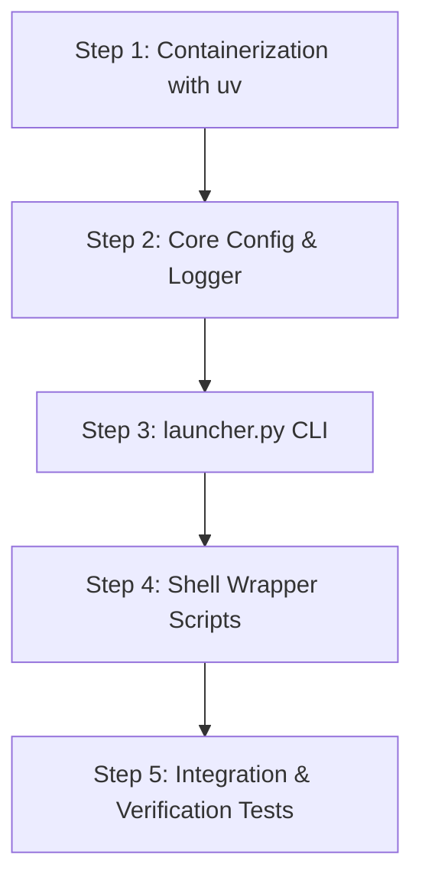

# 🚀 DocForge Bootstrap Action Plan: Docker & Launcher Setup

This document outlines the step-by-step implementation guide for developers to bootstrap the development environment, establish containerization using `uv`, and implement the startup launcher suite (`launcher.py`, `launcher.sh`, `launcher.bat`).

---

## 📌 Project Context
DocForge is a **local-first, offline-capable, agentic document generation platform**. To ensure developers can get up and running in minutes, we are prioritizing:
1. **Containerized Development Environment**: High-speed, reproducible Docker setup using `uv`.
2. **Unified Entry Point (Launcher)**: User-friendly command line and shell wrappers to run diagnostics, launch the Streamlit Web app, launch the Textual Terminal UI, and run tests.

---

## 🗺️ Implementation Roadmap



---

## 🛠️ Step 1: Containerization with `uv`

### 1.1 Dockerfile Implementation
Update the existing [Dockerfile](file:///c:/Users/nisch/OneDrive/Desktop/DocForge/Dockerfile) to utilize `uv` for package management. This eliminates the need for maintaining separate `requirements.txt` files and leverages `uv`'s fast installation caching.

> [!TIP]
> Using the pre-compiled `uv` binary copied from its official image ensures extremely fast builds.

**Recommended Dockerfile Structure:**
```dockerfile
FROM --platform=linux/amd64 python:3.11.15-slim-bookworm

# Python settings
ENV PYTHONDONTWRITEBYTECODE=1
ENV PYTHONUNBUFFERED=1
ENV PYTHONPATH=/app

# Install system dependencies (OCR, PDF generation, UI packages)
RUN apt-get update && apt-get install -y \
    build-essential \
    gcc \
    g++ \
    git \
    curl \
    tesseract-ocr \
    poppler-utils \
    libgl1 \
    libglib2.0-0 \
    && rm -rf /var/lib/apt/lists/*

WORKDIR /app

# Copy dependency definitions
COPY pyproject.toml uv.lock ./

# Install uv from official binary
COPY --from=ghcr.io/astral-sh/uv:latest /uv /uvx /bin/

# Sync dependencies globally within container
RUN uv pip install --system -r pyproject.toml

# Install dev-specific dependencies
RUN uv pip install --system \
    ipython \
    watchdog \
    pytest \
    rich \
    typer \
    textual

# Copy tests and project structures
COPY tests ./tests
COPY docforge ./docforge

EXPOSE 8501 8000 11434

CMD ["bash"]
```

### 1.2 Compose Configuration
Verify [compose.yaml](file:///c:/Users/nisch/OneDrive/Desktop/DocForge/compose.yaml) is configured to map local volumes and ports correctly. Ensure that network settings support connecting to Ollama running on the host machine.

> [!WARNING]
> **Connecting to Host Ollama**: When running inside Docker on Windows/macOS, access Ollama via `http://host.docker.internal:11434`. On Linux, use `http://172.17.0.1:11434` or configure the compose service with `extra_hosts`.

---

## 🎛️ Step 2: Core Configuration & Logger Setup

Before building the launcher, developers should write stubs for config loading and structured logging inside `docforge/core/`.

### 2.1 Logger Stub (`docforge/core/logger.py`)
Implement a structured logger utilizing `rich` for clean terminal output.

```python
import logging
from rich.logging import RichHandler

def get_logger(name: str = "docforge") -> logging.Logger:
    """Returns a logger configured with Rich console formatting."""
    logger = logging.getLogger(name)
    if not logger.handlers:
        logger.setLevel(logging.INFO)
        rich_handler = RichHandler(rich_tracebacks=True, markup=True)
        formatter = logging.Formatter("%(message)s")
        rich_handler.setFormatter(formatter)
        logger.addHandler(rich_handler)
    return logger
```

### 2.2 System Configuration (`docforge/core/config.py`)
Create a simple utility to load configuration options from environment variables or TOML files inside `config/`.

```python
import os
import tomllib
from typing import Any, Dict

DEFAULT_CONFIG_PATH = "docforge/core/config/default.toml"


def load_config(config_path: str = DEFAULT_CONFIG_PATH) -> Dict[str, Any]:
    """Loads configuration options from a TOML file."""
    config: Dict[str, Any] = {}
    if os.path.exists(config_path):
        with open(config_path, "rb") as f:
            config = tomllib.load(f)

    # Inject environment overrides
    config["ollama_host"] = os.getenv("OLLAMA_HOST", config.get("ollama_host", "http://localhost:11434"))
    config["data_dir"] = os.getenv("DATA_DIR", config.get("data_dir", "data"))
    return config
```

---

## 🚀 Step 3: Implement Python Launcher CLI (`launcher.py`)

Create [launcher.py](file:///c:/Users/nisch/OneDrive/Desktop/DocForge/launcher.py) at the root level using standard python libraries (or `typer`/`rich` once the virtualenv is established) to act as the primary CLI.

### 📋 Supported Commands
| Command | Action | Description |
| :--- | :--- | :--- |
| `python launcher.py check` | System Diagnostics | Verifies Python, data folders, write permissions, and connectivity to Ollama. |
| `python launcher.py web` | Launch Streamlit | Executes `streamlit run docforge/app/main.py`. |
| `python launcher.py tui` | Launch Terminal UI | Runs the Textual UI dashboard. |
| `python launcher.py test` | Run Test Suite | Executes unit and integration tests using `pytest`. |

### 🛠️ Reference Implementation for `launcher.py`
```python
import sys
import subprocess
import argparse
import urllib.request
import json
import os

def check_environment():
    """Runs diagnostics to verify the local runtime and dependencies."""
    print("📋 Running System Diagnostics...")
    
    # 1. Python Version Check
    python_ver = sys.version_info
    print(f"  [✓] Python version: {python_ver.major}.{python_ver.minor}.{python_ver.micro}")
    if python_ver < (3, 11):
        print("  [✗] Error: Python 3.11+ is required.")
        return False

    # 2. Write Permissions Check
    data_dir = "data"
    os.makedirs(data_dir, exist_ok=True)
    try:
        test_file = os.path.join(data_dir, ".write_test")
        with open(test_file, "w") as f:
            f.write("test")
        os.remove(test_file)
        print("  [✓] Data directory write permissions: Verified")
    except Exception as e:
        print(f"  [✗] Error: Cannot write to '{data_dir}' directory: {e}")
        return False

    # 3. Ollama Connectivity Check
    ollama_host = os.getenv("OLLAMA_HOST", "http://localhost:11434")
    print(f"  [.] Connecting to Ollama at: {ollama_host}...")
    try:
        with urllib.request.urlopen(f"{ollama_host}/api/tags", timeout=3) as r:
            if r.status == 200:
                data = json.loads(r.read().decode())
                models = [m['name'] for m in data.get('models', [])]
                print(f"  [✓] Ollama server: Online")
                print(f"  [✓] Available Ollama models: {', '.join(models)}")
                
                # Check for critical models
                required_models = ["gemma3:7b", "qwen2.5-coder:7b", "nomic-embed-text"]
                for req in required_models:
                    if any(req in m for m in models):
                        print(f"      - Found model: {req}")
                    else:
                        print(f"      - [WARNING] Missing model: {req}. Please pull using: ollama pull {req}")
            else:
                print(f"  [✗] Ollama server returned status code: {r.status}")
    except Exception as e:
        print(f"  [✗] Error connecting to Ollama: {e}")
        print("      Make sure Ollama is running locally and OLLAMA_HOST is configured correctly.")

    print("🎉 Diagnostics complete.")
    return True

def launch_web():
    print("🚀 Starting Streamlit Web App...")
    subprocess.run(["streamlit", "run", "docforge/app/app.py"])

def launch_tui():
    print("💻 Starting Textual TUI dashboard...")
    # Point this to your Textual app entry point
    subprocess.run(["python", "-m", "docforge.tui.main"])

def run_tests():
    print("🧪 Running PyTest suite...")
    subprocess.run(["pytest", "tests/"])

def main():
    parser = argparse.ArgumentParser(description="DocForge Launcher Utility")
    subparsers = parser.add_subparsers(dest="command", help="Available commands")

    subparsers.add_parser("check", help="Run diagnostic checks")
    subparsers.add_parser("web", help="Start Web UI (Streamlit)")
    subparsers.add_parser("tui", help="Start Terminal UI (Textual)")
    subparsers.add_parser("test", help="Run test suite")

    args = parser.parse_args()

    if args.command == "check":
        success = check_environment()
        sys.exit(0 if success else 1)
    elif args.command == "web":
        launch_web()
    elif args.command == "tui":
        launch_tui()
    elif args.command == "test":
        run_tests()
    else:
        parser.print_help()

if __name__ == "__main__":
    main()
```

---

## 🐚 Step 4: User-Facing Shell Wrappers

To run the launcher easily without manually activating Python virtual environments or typing complex Docker commands, developers should build `launcher.bat` and `launcher.sh`.

### 4.1 Windows Wrapper (`launcher.bat`)
Save this batch file to the project root. It auto-detects `uv`, builds a local `.venv` if it doesn't exist, and passes parameters to `launcher.py`.

```batch
@echo off
setlocal enabledelayedexpansion

:: Check for uv
where uv >nul 2>nul
if %ERRORLEVEL% neq 0 (
    echo [!] "uv" package manager was not found on your PATH.
    echo Please install it: https://docs.astral.sh/uv/getting-started/installation/
    exit /b 1
)

:: Ensure local virtual env exists
if not exist .venv (
    echo [*] Creating virtual environment using uv...
    uv venv
)

:: Sync dependencies if pyproject.toml changed or to verify setup
echo [*] Syncing dependencies...
uv pip install -r pyproject.toml --quiet

:: Execute python launcher
.venv\Scripts\python launcher.py %*
```

### 4.2 Linux/macOS Wrapper (`launcher.sh`)
Save this shell script to the project root.

```bash
#!/usr/bin/env bash
set -e

# Check for uv
if ! command -v uv &> /dev/null; then
    echo "[!] 'uv' package manager not found. Please install it first."
    exit 1
fi

# Ensure local virtual env exists
if [ ! -d ".venv" ]; then
    echo "[*] Creating virtual environment..."
    uv venv
fi

# Sync dependencies
echo "[*] Syncing dependencies..."
uv pip install -r pyproject.toml --quiet

# Execute launcher
.venv/bin/python launcher.py "$@"
```

Ensure the script is executable:
```bash
chmod +x launcher.sh
```

---

## 🧪 Step 5: Integration & Verification Tests

Developers should implement test cases inside the `tests/` directory to ensure configurations parse correctly and service handshakes are valid.

### 5.1 Verification Test Case (`tests/test_bootstrap.py`)
Create a simple test file that verifies imports, directories, and config loading.

```python
import os
import pytest
from docforge.core.config import load_config

def test_config_defaults():
    """Verify config loads correctly and default values are populated."""
    config = load_config()
    assert config is not None
    assert "ollama_host" in config
    assert "data_dir" in config

def test_workspace_dirs():
    """Verify that expected data directory is writeable."""
    config = load_config()
    data_path = config.get("data_dir", "data")
    assert os.path.exists(data_path)
    
    # Try writing a temporary file
    temp_file = os.path.join(data_path, ".test_write")
    with open(temp_file, "w") as f:
        f.write("OK")
    assert os.path.exists(temp_file)
    os.remove(temp_file)
```

Run this test via launcher:
```bash
# Windows
launcher.bat test

# Unix
./launcher.sh test
```
